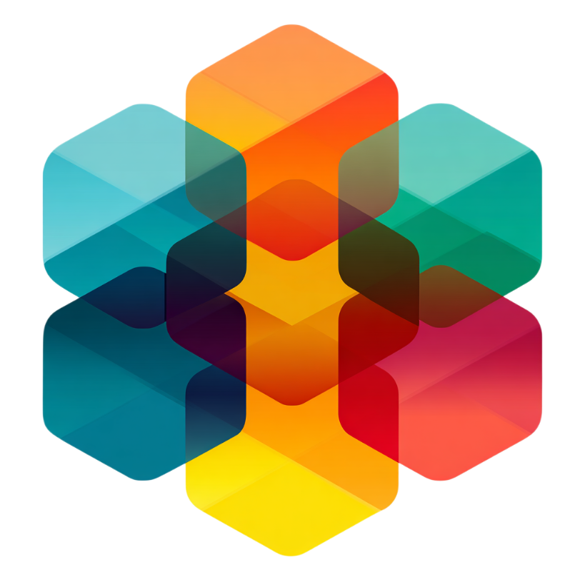
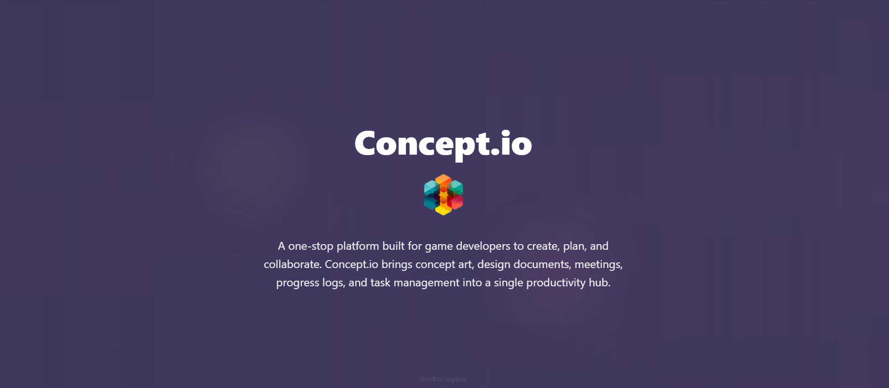
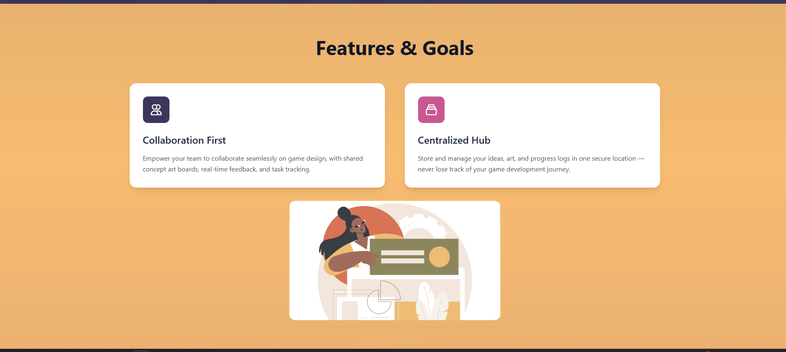
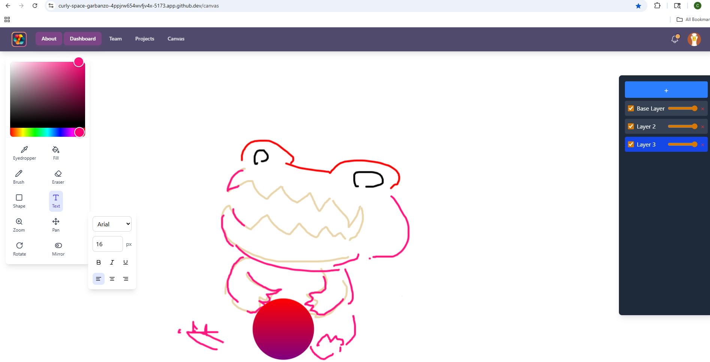
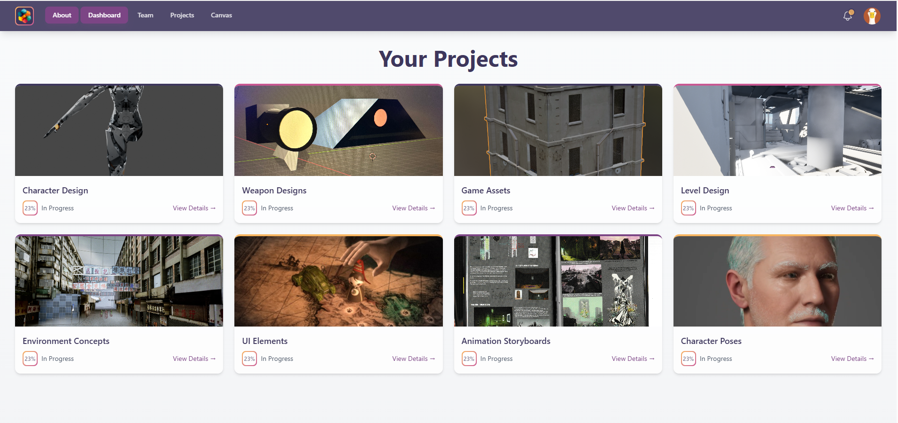
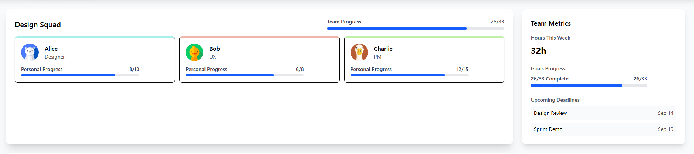

# Concept.io

<div align="center">
  
  <h3>Create, Collaborate, and Track Game Development</h3>
</div>

**Concept.io** is an all-in-one web drawing app and project tracker designed to boost the productivity of game development teams. It serves as a collaborative platform for creating concept art, managing design documents, planning meetings, tracking progress, assigning tasks, and storing game ideas—all in one place.

<div align="center">
  
 

</div>

> **Note:** Concept.io is currently a **work in progress**. The database and backend systems are under active development.

---

##  Key Features
<div align="center">
 
</div>
###  Drawing Tools
<div align="center">
  
</div>

- **Freehand Drawing:** Pen/brush with customizable stroke width and color
- **Shapes:** Draw rectangles, circles, ellipses, lines, polygons, and more
- **Text Objects:** Add and edit text with font, size, color, and alignment options
- **Eraser:** Remove parts of a drawing or erase entire objects
- **Zoom & Pan:** Effortlessly navigate large canvases

###  Layer Management
- **Add/Remove Layers:** Organize artwork like in Photoshop or Illustrator
- **Layer Ordering:** Move layers up or down (z-index)
- **Visibility Toggle:** Show or hide layers as needed
- **Opacity Control:** Adjust transparency per layer

###  Project Management
<div align="center">

  
</div>

- **Task Assignment:** Delegate work and track progress
- **Team Collaboration:** Real-time updates and feedback
- **Version Control:** Track changes and maintain history
- **Asset Organization:** Keep all project files in one place


##  Getting Started

```bash
# Clone the repository
git clone https://github.com/YourUsername/Concept.io.git

# Navigate to the project directory
cd Concept.io/client/concept.io

# Install dependencies
npm install

# Start the development server
npm run dev
```

##  Tech Stack

<div align="center">
  
  
  
  
</div>

##  License

This project is licensed under the MIT License - see the [LICENSE](LICENSE) file for details.
- **Gradients:** Linear and radial fills.
- **Patterns / Textures:** Advanced styling options.
- **Opacity / Alpha Blending:** Per object or per layer.

---

##  Features in Development

- **Grouping/Ungrouping:** Combine objects for easier management.
- **Flip / Mirror:** Horizontal and vertical transformations.
- **Alignment Tools:** Align objects to canvas or each other.
- **Snapping & Smart Guides:** For precise placement.
- **Selection Tools:** Rectangular, lasso, and magic wand.
- **Non-destructive Eraser / Masking.**
- **Import/Export:** SVG, PNG, JPEG, JSON (layers/objects).
- **Snap to Grid / Guides.**
- **Brush Customization:** Pressure-sensitive or shape-based.
- **Filters & Effects:** Blur, shadow, glow, etc.
- **Rulers / Measurements.**
- **Copy / Paste / Duplicate.**
- **Multi-select Objects.**
- **Tooltips & UI Hints.**
- **Keyboard Shortcuts.**
- **Undo/Redo Stack & History Panel.**
- **Touch & Pen Support.**
- **Animation / Frame Layers.**
- **Plugins / Extensions.**
- **Real-Time Collaboration.**
- **AI Assist:** Auto-tracing, shape recognition, color suggestions.
- **Layer Blend Modes.**

---

##  Project Tracking & Collaboration

- **Design Document Repository:** Store and organize all your game ideas and assets.
- **Task Assignment & Progress Logs:** Keep your team on track.
- **Meeting Planning:** Schedule and document upcoming meetings.
- **Collaboration:** Designed for teams, with real-time features in the pipeline.
.

---

**Concept.io** — Your one-stop platform for game art, design, and documentation.
