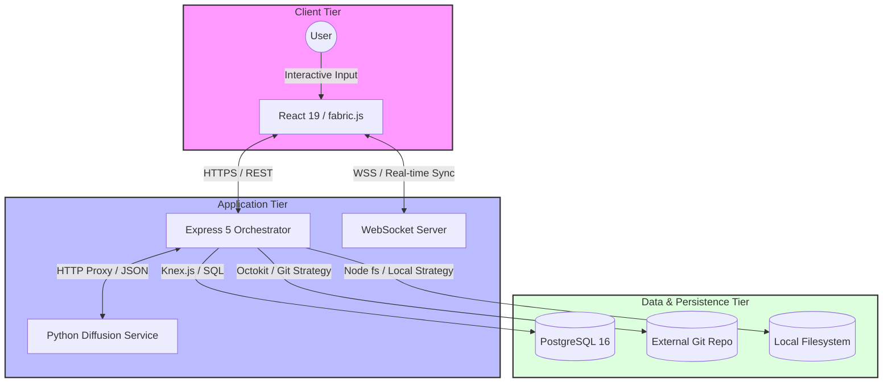
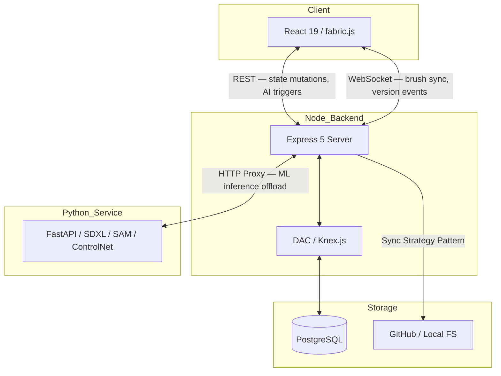
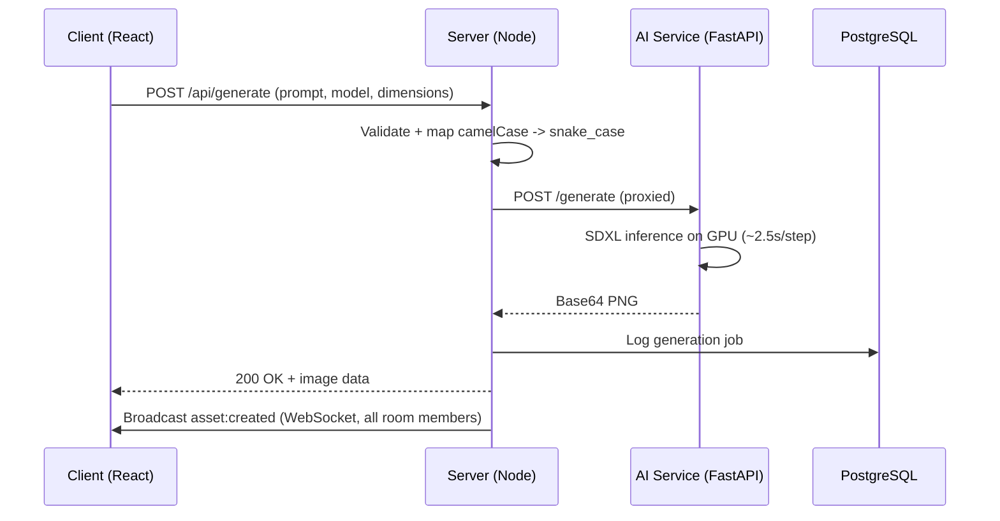
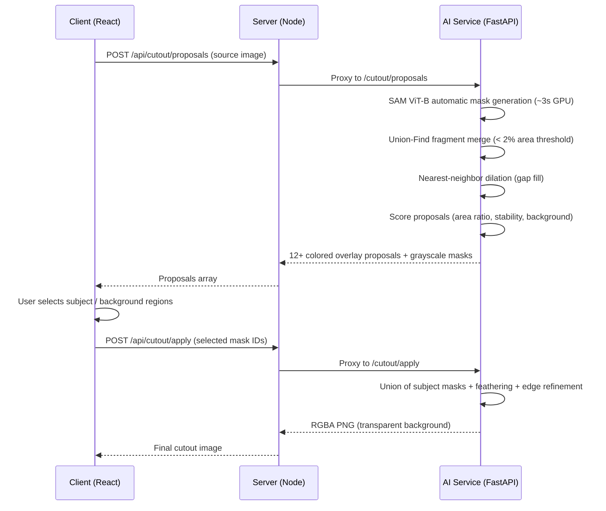

# Concept.io

**A Real-Time Collaborative Canvas with Diffusion-Powered Asset Generation and Git-Like Version Branching**

---


```mermaid
graph TD
    %% User/Client Tier
    subgraph Client_Tier [Client Tier]
        User((User))
        React[React 19 / fabric.js]
    end

    %% Application Tier
    subgraph App_Tier [Application Tier]
        direction TB
        NodeServer[Express 5 Orchestrator]
        WSS[WebSocket Server]
        FastAPI[Python Diffusion Service]
    end

    %% Data Tier
    subgraph Data_Tier [Data & Persistence Tier]
        DB[(PostgreSQL 16)]
        Git[(External Git Repo)]
        FS[(Local Filesystem)]
    end

    %% Connections
    User -->|Interactive Input| React
    React <-->|HTTPS / REST| NodeServer
    React <-->|WSS / Real-time Sync| WSS
    
    NodeServer -->|Knex.js / SQL| DB
    NodeServer <-->|HTTP Proxy / JSON| FastAPI
    
    NodeServer -->|Octokit / Git Strategy| Git
    NodeServer -->|Node fs / Local Strategy| FS

    %% Styling
    style Client_Tier fill:#f9f,stroke:#333,stroke-width:2px
    style App_Tier fill:#bbf,stroke:#333,stroke-width:2px
    style Data_Tier fill:#dfd,stroke:#333,stroke-width:2px
```

## Overview

Concept art workflows are fragmented across disconnected tools: painting applications, AI image generators, and manual file-based version tracking that cannot be shared in real time. Concept.io unifies these into a single browser session by combining a constraint-aware layered canvas, an SDXL + ControlNet diffusion pipeline for in-canvas asset generation and editing, a SAM-based interactive foreground extraction system, and a snapshot-branch version control model that persists to PostgreSQL and syncs to external targets. The result is a workflow where a team can paint, generate, cut out, iterate, branch, and publish without leaving the canvas.

---

## Key Features

**Interactive Canvas with a Typed Brush Engine**
Built on fabric.js 6, which provides an object model above HTML5 Canvas with built-in serialization, blend-mode compositing, and pointer hit testing. The brush engine supports freehand drawing with per-stroke opacity, shadow blur/offset, and six pattern modes. Zoom is clamped per mouse-wheel event (0.1x to 10x) using linear scaling to prevent exponential drift. All drawing events are serialized to JSON and broadcast over WebSocket to every room participant within a single server round trip.

**Constraint-Aware Layer System with Delta Persistence**
Five named layer types (paint, asset, backgroundPlate, lightingOverlay, diffusionRegion) carry declarative tool constraints enforced at runtime. Each layer tracks visibility, opacity, lock state, z-index, and blend mode across 15 modes. Layer state persists as structured JSON in PostgreSQL with delta snapshot support: unchanged layers are stored as reference pointers to a parent snapshot, reducing storage by ~75% in typical iterative workflows.

**Diffusion Asset Generation and Instruction-Based Editing**
A Python FastAPI service wraps four inference pipelines: SDXL text-to-image, CosXL-Edit instruction-based img2img, SDXL inpainting, and ControlNet Union conditioning (pose, depth, soft-edge, canny, tile). Jobs are dispatched asynchronously — the server returns a job ID immediately and the client polls for progress. GPU ETA is computed per step and adjusted by image resolution.

**SAM-Based Interactive Foreground Extraction**
SAM ViT-B runs in automatic mask generation mode, producing 12+ per-object proposals scored on area ratio, stability, and background likelihood. Fragment masks below 2% image area are merged via Union-Find; an iterative nearest-neighbor dilation fills pixel-level coverage gaps at object boundaries. The user selects subject/background regions; the apply step composites the final RGBA cutout with optional feathering. rembg (U2-Net) serves as a sub-0.5s fallback when the SAM checkpoint is unavailable.

**Git-Like Version Control with Branch, Snapshot, and External Sync**
Projects have named branches with a HEAD snapshot pointer. Snapshots record the full serialized layer tree with metadata (name, description, thumbnail, parent ID). Branching, switching, and merging are first-class WebSocket events. On commit, `syncAllEnabled` fans out to all configured external targets (local filesystem or GitHub via Octokit commit trees) using `Promise.allSettled`, logging per-target results and emitting real-time status events back to the client.

---

## System Architecture


```mermaid
graph TD
    subgraph Client
        A[React 19 / fabric.js]
    end

    subgraph Node_Backend
        B[Express 5 Server]
        C[DAC / Knex.js]
    end

    subgraph Python_Service
        D[FastAPI / SDXL / SAM / ControlNet]
    end

    subgraph Storage
        E[(PostgreSQL)]
        F[GitHub / Local FS]
    end

    A <-->|REST — state mutations, AI triggers| B
    A <-->|WebSocket — brush sync, version events| B
    B <--> C
    C <--> E
    B <-->|HTTP Proxy — ML inference offload| D
    B -->|Sync Strategy Pattern| F
```

### Communication Interfaces

| Channel | Protocol | Payload | Responsibility |
|---------|----------|---------|----------------|
| Client -> Server | REST (HTTP) | JSON, up to 100 MB | State mutations, auth, AI triggers, asset CRUD |
| Client <-> Server | WebSocket (ws 8) | JSON events, per-room | Real-time brush sync, version ops, asset vault mutations |
| Server -> Python | HTTP Proxy | JSON (snake_case) | ML inference offload: SDXL, SAM, ControlNet, img2img |
| Server <-> DB | SQL via Knex.js | Structured | Snapshot versioning, branch state, sync logs, asset persistence |
| Server -> External | Strategy (Git / Local) | PNG + JSON | Snapshot export to GitHub repo or local filesystem |

### Sequence: AI Generation Flow


```mermaid
sequenceDiagram
    participant C as Client (React)
    participant S as Server (Node)
    participant AI as AI Service (FastAPI)
    participant DB as PostgreSQL

    C->>S: POST /api/generate (prompt, model, dimensions)
    S->>S: Validate + map camelCase -> snake_case
    S->>AI: POST /generate (proxied)
    AI->>AI: SDXL inference on GPU (~2.5s/step)
    AI-->>S: Base64 PNG
    S->>DB: Log generation job
    S-->>C: 200 OK + image data
    S->>C: Broadcast asset:created (WebSocket, all room members)
```

### Sequence: SAM Cutout Flow


```mermaid
sequenceDiagram
    participant C as Client (React)
    participant S as Server (Node)
    participant AI as AI Service (FastAPI)

    C->>S: POST /api/cutout/proposals (source image)
    S->>AI: Proxy to /cutout/proposals
    AI->>AI: SAM ViT-B automatic mask generation (~3s GPU)
    AI->>AI: Union-Find fragment merge (< 2% area threshold)
    AI->>AI: Nearest-neighbor dilation (gap fill)
    AI->>AI: Score proposals (area ratio, stability, background)
    AI-->>S: 12+ colored overlay proposals + grayscale masks
    S-->>C: Proposals array

    C->>C: User selects subject / background regions
    C->>S: POST /api/cutout/apply (selected mask IDs)
    S->>AI: Proxy to /cutout/apply
    AI->>AI: Union of subject masks + feathering + edge refinement
    AI-->>S: RGBA PNG (transparent background)
    S-->>C: Final cutout image
```

### Sequence: Version Snapshot and Sync


```mermaid
sequenceDiagram
    participant C as Client (React)
    participant S as Server (Node)
    participant DB as PostgreSQL
    participant GH as GitHub (Octokit)
    participant FS as Local Filesystem

    C->>S: WS event: version:snapshot:create (serialized layers)
    S->>DB: INSERT snapshot + per-layer records (delta or full)
    S-->>C: Broadcast version:snapshot:created (all room members)
    S->>S: syncAllEnabled() — Promise.allSettled fan-out
    par Sync targets in parallel
        S->>GH: Commit tree via Octokit (AES-256-GCM token decrypt)
        GH-->>S: Commit SHA
        S->>DB: INSERT sync_logs (success, duration_ms)
        S->>C: WS event: version:sync:status (GitHub — success)
    and
        S->>FS: Write PNGs + metadata.json
        FS-->>S: Done
        S->>DB: INSERT sync_logs (success, duration_ms)
        S->>C: WS event: version:sync:status (Local — success)
    end
```

### Concurrency Model

| Process | Model | Notes |
|---------|-------|-------|
| React client | Single-threaded event loop | Canvas rendering synchronous on main thread via fabric.js; AI jobs are fire-and-forget with polling |
| Node server | Async/await, non-blocking I/O | In-memory room map for O(1) WebSocket broadcast; Knex pool (max 10 DB connections) |
| Python service | Single uvicorn worker | GPU ops block the worker; stateless and horizontally scalable behind a load balancer |
| Sync dispatch | Promise.allSettled fan-out | Targets run in parallel; one failure does not block others |

### Storage

| Layer | Technology | What It Stores |
|-------|-----------|----------------|
| Client | React state + Context API | Canvas object tree, layer list, brush state, version timeline, job queue |
| WebSocket rooms | In-memory Map | Active connections per project room; ephemeral |
| PostgreSQL | Knex.js + pg | Projects, branches, snapshots (full + delta chain), layer snapshots (fabric.js JSON), asset vault, sync targets (AES-256-GCM encrypted tokens), sync logs |
| Dev / test | InMemoryDatabase | Drop-in for the same 37-method IDatabase interface; no Docker required |
| Local FS | Local sync strategy | Per-layer PNGs, composite PNG, metadata JSON |
| Git remote | Octokit commit trees | Snapshot exports pushed to a configured GitHub repository branch |

Delta chain: when a layer carries `snapshotType: 'reference'`, `resolveSnapshot` walks `referenceSnapshotId` links to reconstruct full state without duplicating unchanged layer data across saves.

---

## Tech Stack

| Category | Tooling |
|----------|---------|
| Language | TypeScript 5.8 (client + server), Python 3.10+ (diffusion service) |
| Client framework | React 19, Vite 7, fabric.js 6, Tailwind CSS 4 |
| Client libraries | @xyflow/react (timeline graph), framer-motion, react-router-dom 7, @dnd-kit, react-colorful |
| Server framework | Express 5.1, ws 8 |
| Server libraries | Knex.js 3, pg 8, helmet, morgan, compression, cors, @octokit/rest 22, sharp 0.34 |
| ML / AI | PyTorch 2.3+, diffusers (SDXL, ControlNet, img2img, inpainting), segment-anything (SAM ViT-B), rembg (U2-Net), controlnet-aux, OpenCV, Pillow |
| Database | PostgreSQL 16 (Docker Compose) |
| Infrastructure | Docker Compose, GitHub Actions CI (4-job pipeline), uvicorn ASGI |
| Auth | Auth0 |
| Testing | Jest 30, ts-jest, supertest (141+ tests), ESLint 9 |

---

## Performance and Engineering Decisions

| Decision | Rationale | Trade-off |
|----------|-----------|-----------|
| fabric.js over raw Canvas2D | Built-in object model, serialization, and blend-mode compositing eliminated a custom scene graph; `toJSON`/`loadFromJSON` serves as both the broadcast and DB persistence format | Single-threaded synchronous rendering; scenes exceeding ~1,000 objects can stall the main thread |
| In-memory WebSocket rooms over Redis Pub/Sub | Direct broadcast from the server's room map avoids serialization overhead and a network hop, keeping brush sync latency under 15ms on LAN | Cannot scale horizontally without sticky sessions or a shared room-membership layer |
| SAM ViT-B + Union-Find over rembg alone | rembg produces aggressive binary masks that erase fine detail; SAM generates composable per-object masks; Union-Find + dilation ensures every pixel is assigned before the user commits a selection | 375 MB checkpoint; ~3s per image on GPU vs. ~0.5s for rembg |
| Delta snapshots with chain resolution | Storing unchanged layers as reference pointers reduces storage ~75% for typical iterative workflows where one or two layers change per save | Restore latency scales linearly with chain depth |
| Strategy pattern for sync dispatch | Adding a new sync target (S3, FTP) requires only a new strategy file with no changes to the orchestrator or controller | Each strategy must independently implement retry logic and error reporting |
| AES-256-GCM encryption for sync credentials | Git tokens are encrypted at rest and decrypted only at dispatch time, limiting blast radius on a DB compromise | Key loss makes stored credentials unrecoverable |

---

## Technical Challenges

**Pixel-gap coverage in SAM masks.** SAM ViT-B often leaves thin unclassified strips at object boundaries where no mask claims ownership. A naive union of selected masks produces visible holes at cutout edges. The fix: after Union-Find fragment merging, an iterative nearest-neighbor dilation pass assigns each unclaimed pixel to the adjacent mask with the highest composite score, running until convergence. This adds ~40ms of CPU NumPy work but eliminates all holes without blurring the boundary.

**Exponential zoom drift on fast mouse-wheel input.** Applying a fixed multiplicative factor per wheel event (`zoom *= 1.1`) compounds across rapid scroll events and sends the canvas to extreme values within seconds. The fix: read the raw `deltaY`, apply a linear scale mapping, and clamp each event's contribution to a 0.8x-1.25x window before composing with the current zoom level. The global range is hard-bounded at 0.1x-10x regardless of scroll speed.

**Z-index desync between fabric.js object order and React layer state.** fabric.js maintains its own internal object stack independent of React state. When layers are reordered in the UI, re-adding objects naively duplicates or misorders them on the canvas. The fix: `reorderCanvasObjects` collects all canvas objects, sorts them by their assigned layer z-index, removes them all atomically, and re-adds them in the correct order inside a `requestAnimationFrame` callback to prevent mid-frame visual tearing.

---

## Error Handling and Edge Cases

- **Python service unavailable:** The Node proxy catches connection-refused errors and returns a structured `503` with a `serviceUnavailable` error code. The client surfaces a toast and marks the job failed rather than silently dropping it.
- **SAM checkpoint missing at startup:** The cutout service detects the missing model file on init and falls back to rembg for all requests. The response includes a `fallback: true` flag so the client can inform the user that interactive region selection is unavailable.
- **Sync target failure:** `Promise.allSettled` isolates failures per target. Each result is written to `sync_logs` with status and error detail. A per-target `version:sync:status` WebSocket event lets the client show which targets succeeded and which failed without blocking the snapshot commit.
- **Broken delta chain:** If `resolveSnapshot` encounters a missing intermediate reference, it falls back to the most recent reachable full snapshot rather than throwing, preventing a total restore failure at the cost of potentially stale layer data.
- **WebSocket reconnection:** The client uses exponential backoff on disconnect. On reconnect it rejoins the project room and requests the current canvas history log to replay events missed during the gap.

---

## Getting Started

### Prerequisites

- Node.js >= 20
- Python 3.10+ (conda recommended)
- Docker (for PostgreSQL)
- CUDA GPU recommended; CPU fallback is supported at reduced throughput
- SAM ViT-B checkpoint: download `sam_vit_b_01ec64.pth` from the Facebook Research segment-anything release and place at `server/diffusion-service/models/sam_vit_b.pth`

### Installation and Usage

```bash
# Clone the repository
git clone https://github.com/yourusername/Concept.io.git
cd Concept.io

# Install all Node dependencies (client + server via npm workspaces)
npm run install:all

# Start PostgreSQL
npm run db:up

# Run database migrations
npm run db:migrate

# Configure environment
cp server/.env.example server/.env
# Required: DB_DRIVER, DATABASE_URL, DIFFUSION_SERVICE_URL, SYNC_ENCRYPTION_KEY

# Install Python dependencies
cd server/diffusion-service && pip install -r requirements.txt && cd ../..

# Start all three services
npm run dev:all

# Or individually:
npm run dev:client      # Vite on port 5173
npm run dev:server      # Express + WebSocket on port 5000
npm run dev:diffusion   # FastAPI on port 8000

# Test, lint, typecheck
npm test
npm run test:coverage
npm run lint
npm run typecheck
```

---

## Future Improvements

- **Redis Pub/Sub for WebSocket rooms** to enable horizontal scaling of the Node server without sticky sessions.
- **BullMQ job queue for diffusion** to decouple SDXL inference from the HTTP request lifecycle and support a pool of GPU workers.
- **Prometheus + Grafana** for generation latency per model, SAM processing time, WebSocket throughput, and sync success/failure rates.
- **S3 sync strategy** as a third sync target alongside local filesystem and Git.
- **Snapshot chain compaction** as a background job to bound restore latency by rewriting long delta chains into a single full snapshot.
- **CRDT conflict resolution** to replace last-write-wins broadcast with a model that handles true concurrent edits to the same layer without data loss.
- **Pressure-sensitive brush input** via Pointer Events API for stylus pressure and tilt on drawing tablets.
- **Multi-worker diffusion service** with gunicorn + uvicorn workers and per-worker GPU memory partitioning for concurrent inference.
