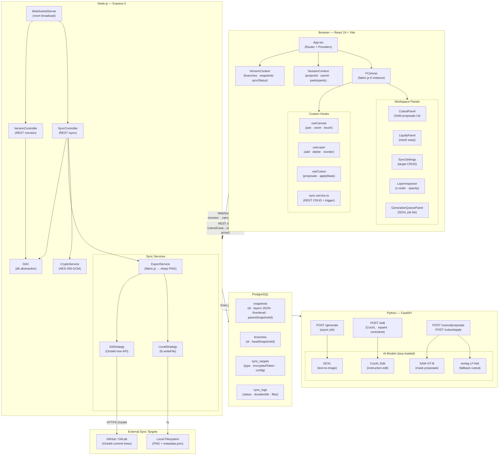
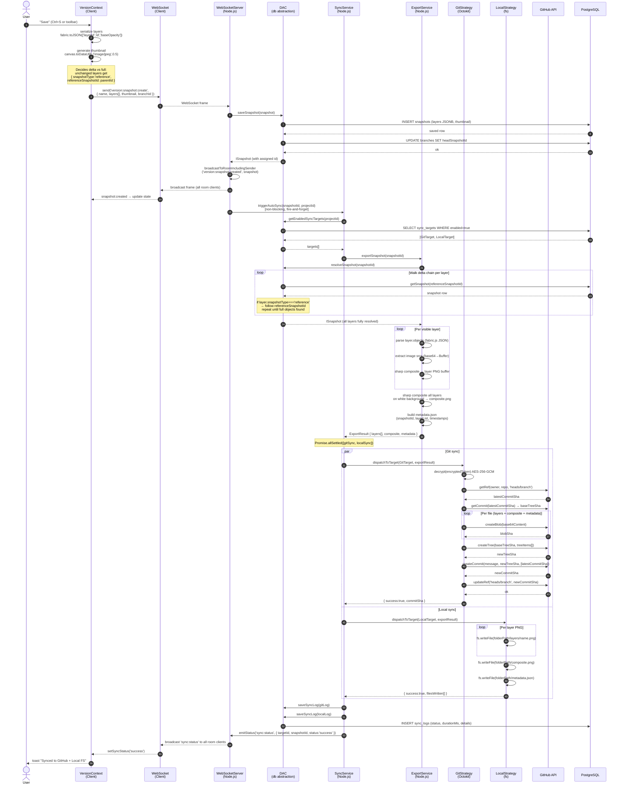
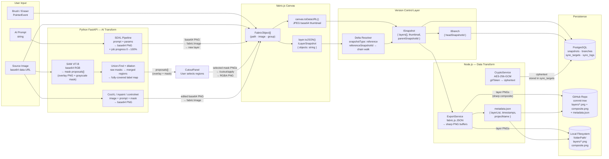
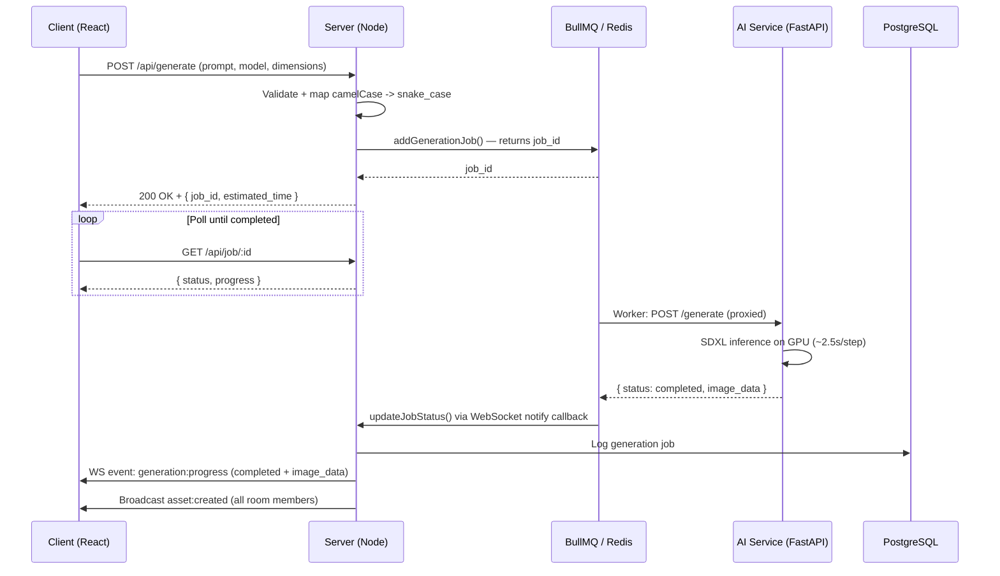
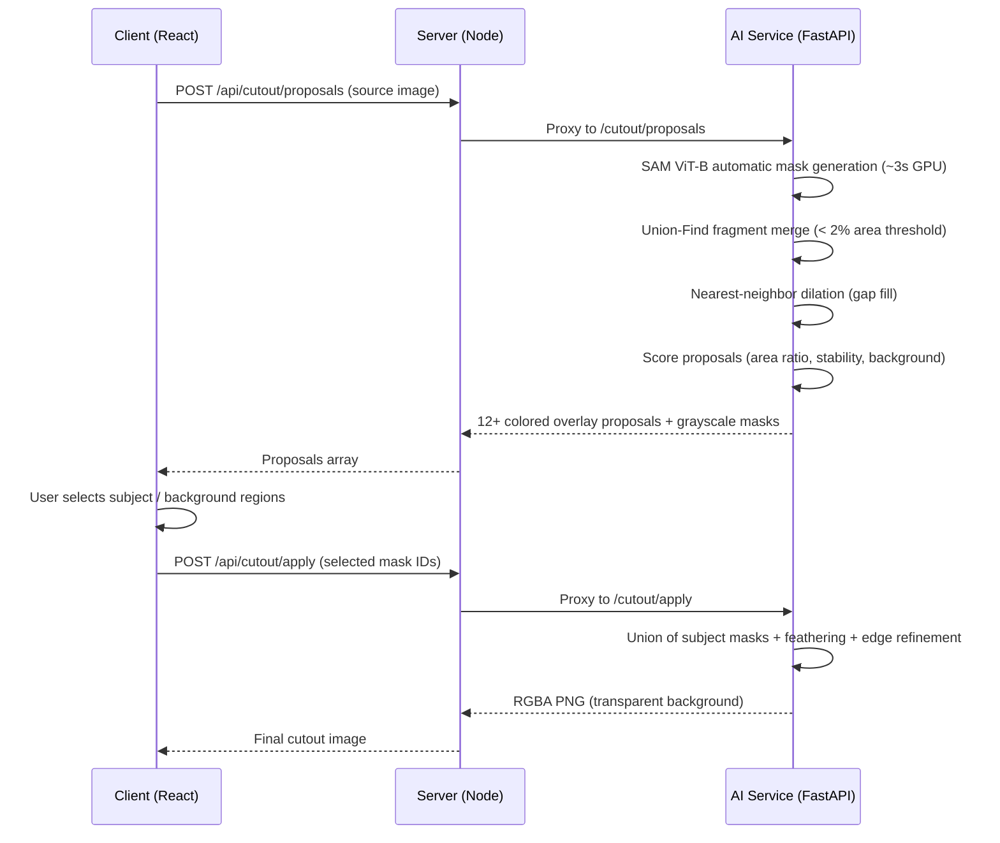
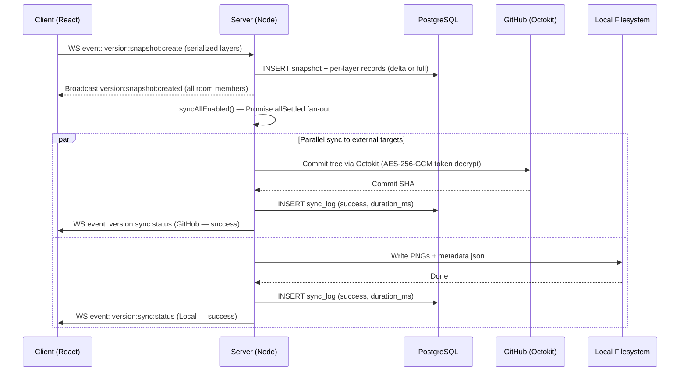

# Concept.io — Architecture & Data Flow Diagrams

---

## 1. System Architecture



---

## 2. Sequence — Delta Snapshot Reconstruction & Auto-Sync

> **Most complex flow**: user saves → snapshot delta computed → WebSocket broadcast → parallel sync fan-out to GitHub + local → each target runs export (delta chain walk → sharp compositing) → blobs pushed via Octokit tree API → status emitted back to all clients.



---

## 3. System Data Flow — Canvas → AI → Version Control

> Focused on **data transformations**: what enters each boundary, what shape it takes, and where it lands.



---

## 4. Architectural Philosophy

Concept.io separates concerns into three independently deployable services:

1. **Client (React + fabric.js)** — Responsible for canvas rendering and capturing user interaction. Communicates with the application server over REST and WebSocket only; it has no direct knowledge of the database or ML service.

2. **Application Server (Node.js + Express)** — Coordinates collaboration, persistence, and external integrations. Acts as an HTTP proxy to the ML service, translating field naming conventions at the boundary. Manages WebSocket rooms and version control state.

3. **AI Service (Python + FastAPI)** — Handles GPU-bound ML inference independently of the web server. Stateless and horizontally scalable behind a load balancer. Never writes to the database directly.

This separation allows the inference tier to be scaled independently (multiple GPU workers behind the BullMQ queue), the web tier to be scaled independently (multiple Node instances with shared room state), and each service to be deployed and versioned separately.

---

## 5. Collaboration Model

Canvas operations are serialized as fabric.js JSON mutations and broadcast over WebSocket to all participants in the project room. Conflict resolution currently uses a **last-write-wins model** per object: the last client to broadcast a mutation for a given canvas object wins. This is safe for the primary use case of concurrent drawing on different parts of the canvas.

True concurrent edits to the same layer object (e.g., two clients moving the same element simultaneously) will result in one update overwriting the other. CRDT-based reconciliation is planned as a future improvement.

---

## 6. Communication Interfaces

| Channel | Protocol | Payload | Responsibility |
|---------|----------|---------|----------------|
| Client -> Server | REST (HTTP) | JSON, up to 100 MB | State mutations, auth, AI triggers, asset CRUD |
| Client <-> Server | WebSocket (ws 8) | JSON events, per-room | Real-time brush sync, version ops, asset vault mutations |
| Server -> Python | HTTP (via BullMQ worker) | JSON (snake_case) | ML inference offload: SDXL, SAM, ControlNet, img2img |
| Server <-> DB | SQL via Knex.js | Structured | Snapshot versioning, branch state, sync logs, asset persistence |
| Server -> External | Strategy (Git / Local) | PNG + JSON | Parallel sync to external targets |

---

## 7. Sequence: AI Generation Flow

Generation is fully asynchronous. The Node server enqueues a job via BullMQ; the client polls `/api/job/:id` for progress. Jobs can be cancelled at any point.



---

## 8. Sequence: SAM Cutout Flow



---

## 9. Sequence: Version Snapshot and Parallel Sync



---

## 10. Concurrency Model

| Process | Model | Notes |
|---------|-------|-------|
| React client | Single-threaded event loop | Canvas rendering synchronous on main thread via fabric.js; AI jobs are fire-and-forget with WebSocket progress updates |
| Node server | Async/await, non-blocking I/O | In-memory room map for O(1) WebSocket broadcast; Knex pool (max 10 DB connections) |
| BullMQ worker | Redis-backed job queue | GPU ops block the worker; queue isolates inference from the HTTP request lifecycle |
| Python service | Single uvicorn worker | Stateless and horizontally scalable behind a load balancer |
| Sync dispatch | Promise.allSettled fan-out | Targets run in parallel; one failure does not block others |

---

## 11. Storage Architecture

| Layer | Technology | What It Stores |
|-------|-----------|----------------|
| Client | React state + Context API | Canvas object tree, layer list, brush state, version timeline, job queue |
| WebSocket rooms | In-memory Map | Active connections per project room; ephemeral |
| Job queue | BullMQ + Redis | Generation job state, progress, cancellation flags; completed jobs retained 1 hour |
| PostgreSQL | Knex.js + pg | Projects, branches, snapshots (full + delta chain), layer snapshots (fabric.js JSON), asset vault, sync targets (AES-256-GCM encrypted tokens), sync logs |
| Dev / test | InMemoryDatabase | Drop-in for the same IDatabase interface; no Docker required |
| Local FS | Local sync strategy | Per-layer PNGs, composite PNG, metadata JSON |
| Git remote | Octokit commit trees | Snapshot exports pushed to a configured GitHub repository branch |

---

## 12. Scalability Model

Concept.io scales across three independent tiers:

**Web tier**  
The Node server is stateless aside from in-memory WebSocket room membership. Multiple instances can run behind a load balancer with sticky sessions (current). For sessionless horizontal scaling, the in-memory room map moves to Redis Pub/Sub so any Node instance can broadcast to any room.

**AI inference tier**  
The Python FastAPI service is stateless and can be scaled horizontally behind a load balancer. BullMQ dispatches jobs to workers, decoupling inference from the HTTP request lifecycle. Multiple GPU workers can consume from the same queue for concurrent generation.

**Storage tier**  
PostgreSQL handles structured metadata. Large binary assets (exported PNGs, snapshots) are offloaded to external targets (local FS, GitHub, planned S3) rather than stored in the database. Delta snapshot compression keeps the per-snapshot write volume proportional to the number of changed layers, not the full canvas size.

---

## 13. Technical Deep Dives

### Pixel-gap coverage in SAM masks

**Problem:** SAM ViT-B often leaves thin unclassified strips at object boundaries where no mask claims ownership. A naive union of selected masks produces visible holes at cutout edges.

**Solution:** After Union-Find fragment merging (merging fragments below 2% image area), an iterative nearest-neighbor dilation pass assigns each unclaimed pixel to the adjacent mask with the highest composite score, running until convergence.

**Result:** Zero pixel gaps at boundaries, ~40ms of CPU NumPy overhead per mask — eliminates all holes without blurring the boundary.

### Exponential zoom drift on fast mouse-wheel input

**Problem:** Applying a fixed multiplicative factor per wheel event (`zoom *= 1.1`) compounds across rapid scroll events and sends the canvas to extreme values within seconds.

**Solution:** Read the raw `deltaY`, apply a linear scale mapping, and clamp each event's contribution to a 0.8x–1.25x window before composing with the current zoom level. The global range is hard-bounded at 0.1x–10x regardless of scroll speed.

**Result:** Smooth, predictable zoom behavior across all input speeds and devices.

### Z-index desync between fabric.js object order and React layer state

**Problem:** fabric.js maintains its own internal object stack independent of React state. When layers are reordered in the UI, re-adding objects naively duplicates or misorders them on the canvas.

**Solution:** `reorderCanvasObjects` collects all canvas objects, sorts them by their assigned layer z-index, removes them all atomically, and re-adds them in the correct order inside a `requestAnimationFrame` callback to prevent mid-frame visual tearing.

**Result:** Layer order in the UI is always consistent with the fabric.js render stack.

### Delta snapshot compression algorithm

When creating a snapshot, the system compares each layer to its previous snapshot:
- If unchanged: stores `{ snapshotType: 'reference', referenceSnapshotId: previousId }` — only a pointer
- If changed: stores full fabric.js JSON as `{ snapshotType: 'full' }`

`resolveSnapshot` walks the reference chain until it finds a full snapshot or reaches a configured depth limit, reconstructing the complete layer set for restore. This reduces storage ~75% for typical iterative workflows where one or two layers change per save.

---

## 14. Database Schema

```
branches         (id, project_id, name, head_snapshot_id, created_by, created_at, color)
snapshots        (id, project_id, branch_id, name, description, thumbnail, created_by, created_at, parent_snapshot_id)
layer_snapshots  (id, snapshot_id, layer_id, name, type, objects, visible, opacity, blend_mode, z_index)
sync_targets     (id, project_id, type, name, config[encrypted], enabled, last_synced_at, last_sync_status, created_by, ...)
sync_log         (id, sync_target_id, snapshot_id, status, message, details, started_at, completed_at, duration_ms)
```

A `branch` is a mutable pointer to its HEAD snapshot. A `snapshot` is equivalent to a commit; `layer_snapshots` with `snapshotType: 'reference'` store only a pointer to an unchanged layer from a parent snapshot — `resolveSnapshot` walks the chain to reconstruct the full layer set.

---

## 15. Key Technical Decisions & Trade-offs

| Decision | Why | Trade-off | Alternative Considered |
|----------|-----|-----------|------------------------|
| fabric.js over raw Canvas2D | Built-in object model, serialization, and blend-mode compositing; `toJSON`/`loadFromJSON` serves as both the broadcast and DB persistence format | Single-threaded synchronous rendering; scenes exceeding ~1,000 objects can stall the main thread | Pixi.js (abandoned for object model complexity) |
| In-memory WebSocket rooms over Redis Pub/Sub | Direct broadcast avoids serialization overhead and a network hop, keeping brush sync latency under 15ms on LAN | Cannot scale horizontally without sticky sessions or a shared room-membership layer | Redis Pub/Sub (planned for horizontal scaling) |
| BullMQ job queue for generation | Decouples inference from HTTP request lifecycle; supports cancellation, retries, and progress tracking | Requires Redis as an additional runtime dependency | Direct HTTP proxy (abandoned — blocked request lifecycle) |
| Individual ControlNet models over ControlNet-Union | Union (~1.5 GB) + SDXL UNet (~2.6 GB) exceeds 8 GB VRAM; individual models (315-700 MB) keep peak VRAM at ~3.5-4 GB | One checkpoint per control type; first use of each type incurs a disk load; type switches cost ~2s device move | ControlNet-Union (exceeded VRAM budget) |
| SAM ViT-B + Union-Find over rembg alone | rembg produces aggressive binary masks that erase fine detail; SAM generates composable per-object masks; Union-Find + dilation ensures every pixel is assigned | 375 MB checkpoint; ~3s per image on GPU vs. ~0.5s for rembg | rembg-only (kept as fallback) |
| Delta snapshots with chain resolution | Storing unchanged layers as reference pointers reduces storage ~75% for iterative workflows | Restore latency scales linearly with chain depth | Full snapshots only (storage bloat) |
| Strategy pattern for sync dispatch | Adding a new sync target (S3, FTP) requires only a new strategy file with no changes to the orchestrator or controller | Each strategy must independently implement retry logic and error reporting | Monolithic sync handler |
| AES-256-GCM encryption for sync credentials | Git tokens are encrypted at rest and decrypted only at dispatch time, limiting blast radius on a DB compromise | Key loss makes stored credentials unrecoverable | Plaintext storage (unacceptable) |

---

## 16. Error Handling & Edge Cases

- **Python service unavailable:** The Node proxy catches connection-refused errors and returns a structured `503` with a `serviceUnavailable` error code. The client surfaces a toast and marks the job failed rather than silently dropping it.
- **SAM checkpoint missing at startup:** The cutout service detects the missing model file on init and falls back to rembg for all requests. The response includes a `fallback: true` flag so the client can inform the user that interactive region selection is unavailable.
- **Sync target failure:** `Promise.allSettled` isolates failures per target. Each result is written to `sync_log` with status and error detail. A per-target `version:sync:status` WebSocket event lets the client show which targets succeeded and which failed without blocking the snapshot commit.
- **Broken delta chain:** If `resolveSnapshot` encounters a missing intermediate reference, it falls back to the most recent reachable full snapshot rather than throwing, preventing a total restore failure at the cost of potentially stale layer data.
- **WebSocket reconnection:** The client uses exponential backoff on disconnect. On reconnect it rejoins the project room and requests the current canvas history log to replay events missed during the gap.
- **Generation job cancellation:** Cancelled jobs are tracked in a `cancelledJobs` Set. The BullMQ worker checks this on each poll cycle and bails out; waiting jobs are removed from the queue immediately.
